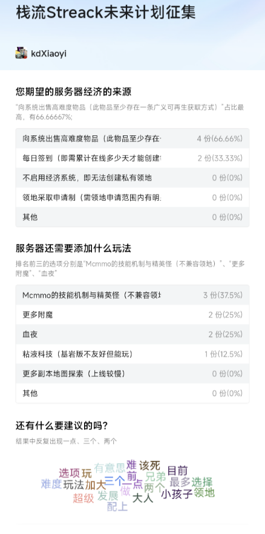

<small>创建：2025-03-05 | 最后更新：2025-03-05</small> 

> [i] [调研问卷网址฿](https://docs.qq.com/form/page/DV0RTU1dhR3ZyRWRK)

> [i] [下载源结果文件（已剔除隐私信息）](./result.csv) 其SHA256为`c5e4db9fd9ef9b6dec5a480e5dc70ad0567bc43abd9fe220948f0e6e854c69cc`

结果如图所示。

